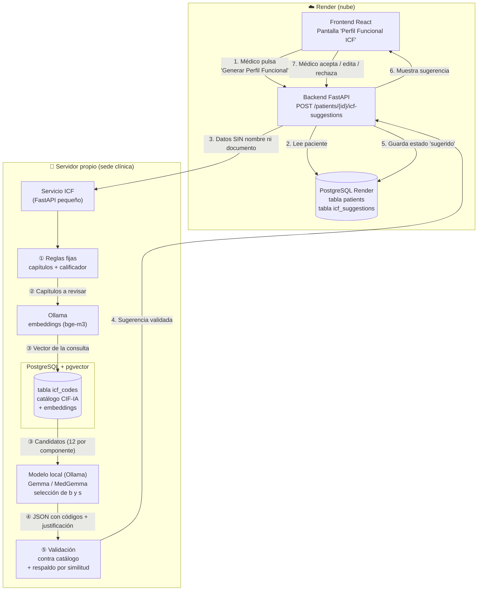
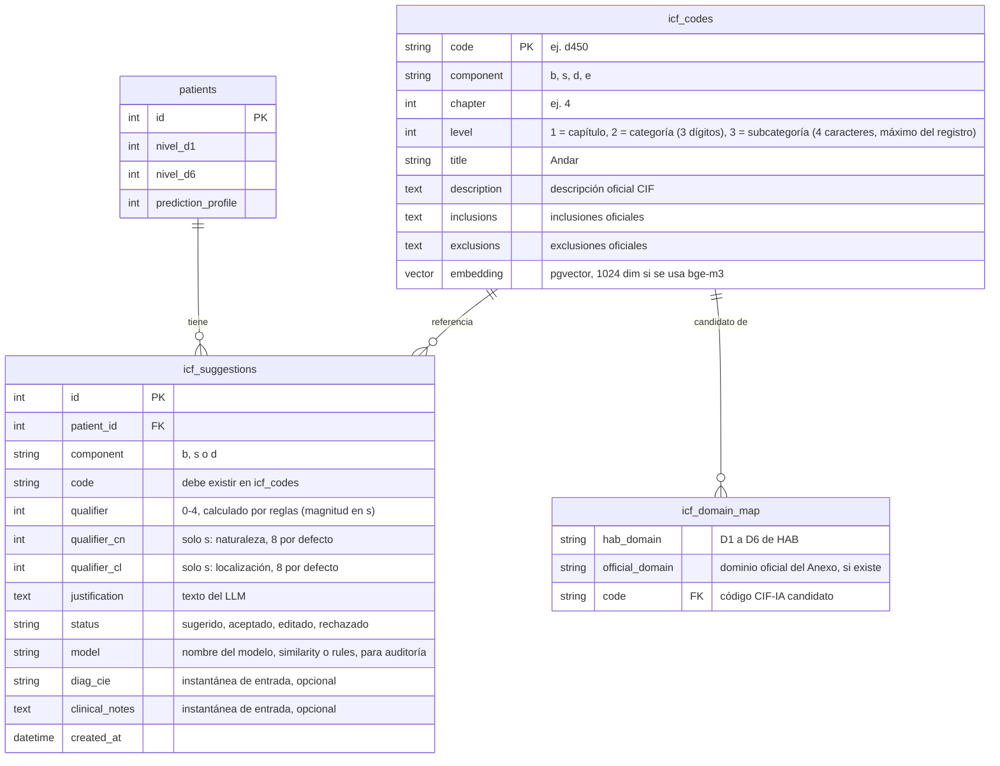

# Cómo funciona la sugerencia de códigos CIF/ICF con RAG en PostgreSQL

**Proyecto:** Health Access Bridge · **Momento 3 · HU-07**
**Objetivo:** que un LLM sugiera códigos CIF/ICF a partir de los datos del paciente, **sin entrenarlo**, usando solo el estándar CIF como fuente de conocimiento. El modelo es **local, de pesos abiertos y sin APIs externas** (decisión del 06-oct-2026 por privacidad): las pruebas con un modelo de ~3B (`qwen2.5:3b`) en el servidor físico (i3, sin GPU) no mejoraron la selección ni la velocidad (ver [§10](#10-resultados-de-las-pruebas-con-el-servidor-físico-y-qwen-06-oct-2026)), por lo que se prueban modelos más grandes de Google (Gemma 4 y MedGemma) en un PC con GPU para hallar el mínimo viable (HU-07f). El médico acepta o edita la sugerencia.
**Marco normativo:** Anexo Técnico de la **Resolución 1239 del 21 de julio de 2022** (procedimiento de certificación de discapacidad y Registro de Localización y Caracterización de Personas con Discapacidad, RLCPD), de aplicación para toda la población con discapacidad de Colombia, que usa la **CIF-IA** (versión infancia y adolescencia, OMS 2011). El perfil de funcionamiento oficial tiene **3 códigos por componente** (funciones b, estructuras s, actividades y participación d), cada uno con calificador. HAB genera un **borrador de apoyo**: el certificado lo emite el equipo multidisciplinario en el aplicativo RLCPD.

---

## 1. La idea en una frase

> **RAG = examen a libro abierto.** No le enseñamos la CIF al modelo (eso sería entrenarlo). En cada consulta **buscamos en PostgreSQL las páginas del "libro" CIF que aplican a ese paciente** y se las damos al modelo junto con la pregunta. El modelo solo elige entre esas opciones y explica por qué.

| Enfoque | Qué requiere | ¿Aplica aquí? |
|---|---|---|
| **Fine-tuning** (entrenar) | Miles de casos etiquetados por médicos + GPU para entrenar | ❌ No hay datos etiquetados |
| **Solo prompt** (preguntarle al modelo "¿qué código CIF es?") | Nada | ❌ Un modelo sin lista cerrada **inventa códigos** (más aún uno de 3B) |
| **RAG** (buscar + dar contexto + restringir la respuesta) | El catálogo CIF cargado en PostgreSQL | ✅ **Enfoque elegido** |

RAG significa *Retrieval-Augmented Generation*: generación de texto aumentada con información recuperada de una base de datos.

---

## 2. Diagrama general



**Qué se queda en cada lugar:**

- **Render (nube):** los pacientes y lo que el médico decide sobre cada sugerencia. Todo esto ya existe hoy, salvo la tabla `icf_suggestions`.
- **Servidor propio:** el catálogo CIF con su base pgvector, Ollama para calcular embeddings y ejecutar el modelo de selección (según la fase, en un PC de pruebas con GPU o en la máquina de producción), el servicio que arma la consulta y el respaldo por similitud.
- **Modelo de selección (local):** recibe la lista de candidatos de funciones y estructuras y los datos clínicos mínimos (sin nombre ni documento), y devuelve los códigos elegidos. Corre con Ollama en infraestructura propia (hoy en un PC de pruebas con GPU; mañana en la máquina de producción que dimensione HU-07h): **ningún dato sale de la infraestructura propia**.
- **Hacia el servidor propio ni hacia el modelo nunca viaja** el nombre ni el documento del paciente. Solo viajan edad, género, causa, categorías, niveles D1–D6, la predicción de barreras y, si el médico los escribe, el diagnóstico CIE y las notas clínicas. **No se envía la orientación sexual** (no aporta a la codificación). Como las notas son texto libre, la pantalla advierte no incluir datos identificables.

---

## 3. Paso a paso con un paciente real (María Fernanda López)

Datos de entrada, los mismos del mockup:

| Campo | Valor |
|---|---|
| Edad / Género | 35 / Femenino |
| Causa | Enfermedad congénita |
| Cat. física / psicosocial | Severa / Moderada |
| D1 Aprendizaje | 70 |
| D2 Tareas generales | 65 |
| D3 Comunicación | 75 |
| D4 Movilidad | 60 |
| D5 Autocuidado | 55 |
| D6 Vida doméstica | 80 |
| Predicción de barreras | Perfil 2 (barreras altas) |
| Diagnóstico CIE (opcional) | lo escribe el médico en la pantalla; en este ejemplo, vacío |
| Notas clínicas (opcional) | lo escribe el médico en la pantalla; en este ejemplo, vacío |

> Sin diagnóstico ni notas el modelo solo cuenta con la causa y las categorías, así que las sugerencias de funciones (b) y estructuras (s) serán genéricas. El Anexo identifica b y s a partir de la historia clínica (diagnóstico CIE, soportes y causa), por eso la pantalla ofrece estos dos campos.

### ① Reglas fijas (sin LLM)

Los niveles D1–D6 de HAB **corresponden a los capítulos 1 a 6 de "Actividades y Participación" de la CIF** (Aprendizaje, Tareas generales, Comunicación, Movilidad, Autocuidado, Vida doméstica). **No son los 6 dominios oficiales del Anexo** (Cognición, Movilidad, Cuidado personal, Relaciones, Actividades cotidianas, Participación). Se mantienen los niveles de HAB (los usan el modelo predictivo, el formulario y los datos) con un **mapeo explícito**. Dos cosas se resuelven con código normal, sin LLM:

**a) Qué capítulos revisar:** los que tengan nivel ≥ 5 (es decir, con algún problema).

| Nivel HAB | Capítulo CIF-IA | Dominio oficial del Anexo (referencia) |
|---|---|---|
| D1 | d1 — Aprendizaje y aplicación del conocimiento | D1 Cognición |
| D2 | d2 — Tareas y demandas generales | Sin equivalente directo |
| D3 | d3 — Comunicación | Parcial: d310 y d350 están en Cognición |
| D4 | d4 — Movilidad | D2 Movilidad |
| D5 | d5 — Autocuidado | D3 Cuidado personal |
| D6 | d6 — Vida doméstica | D5 Actividades cotidianas (d640, tareas domésticas) |

Los dominios oficiales **Relaciones** (d7) y **Participación** (d9) no tienen equivalente en HAB. Por eso el reporte rotula los niveles como "niveles internos de HAB" y **no** como el "nivel de dificultad en el desempeño" oficial (que el Anexo calcula con fórmulas propias y aclara que no es un porcentaje de discapacidad).

**b) El calificador (gravedad 0–4):** la escala genérica de la CIF (Tabla 2 del Anexo) define rangos en porcentaje, que se aplican a la escala 0–100 de HAB:

| Nivel HAB (0–100) | Calificador CIF | Significado |
|---|---|---|
| 0 – 4 | `.0` | No hay problema |
| 5 – 24 | `.1` | Problema ligero |
| 25 – 49 | `.2` | Problema moderado |
| 50 – 95 | `.3` | Problema grave |
| 96 – 100 | `.4` | Problema completo |

En María todos sus niveles están entre 50 y 95, así que **todos sus capítulos llevan calificador `.3` (grave)**. Esto lo calcula el código y **el LLM no lo decide**, para que no pueda equivocarse en la gravedad.

> ⚠️ **Limitación a tener en cuenta:** HAB mide un nivel por **capítulo** (ej. "Movilidad = 60"), pero la CIF codifica por **categoría** (ej. d450 Andar, d440 Uso fino de la mano), y oficialmente el calificador sale de **cada pregunta** del instrumento (0–4), no del porcentaje del dominio. El calificador de cada categoría sugerida se toma del nivel de su capítulo. Es una aproximación, queda marcada como **sugerida** y **el médico puede editarla**. En funciones (b) y estructuras (s) solo cuentan calificadores desde 1.

**c) Pacientes menores de 6 años:** el Anexo no calcula niveles por dominio para 0–5 años (usa una lista de chequeo sin puntajes). Si la edad es menor de 6, el sistema avisa y no genera la sugerencia basada en D1–D6.

### ② y ③ Búsqueda en PostgreSQL (la "R" de RAG)

Se construye **un solo texto clínico** con el diagnóstico (sin el código CIE, que no le dice nada al buscador) y las notas del médico; si no escribió nada, se usa la causa y las categorías. Se convierte en un vector con el modelo de embeddings (`bge-m3`) y se usa de dos maneras distintas según el componente:

**Actividades y participación (d): lista cerrada del Anexo.** Las tablas 9 y 11 del Anexo ligan cada pregunta del instrumento con códigos CIF-IA concretos (ej. Movilidad: `d4154`, `d4104`, `d4600`, `d4602`, `d4501`). Esos 32 códigos están en la tabla `icf_domain_map`, marcados por grupo de edad (6–17 años, 18 o más, o ambos). Para los capítulos D1–D6 con nivel ≥ 5 se toman sus códigos y **se ordenan por calificador (mayor primero) y, a igual calificador, por similitud con el texto clínico**. No pasan por el modelo de generación. Si un capítulo no tiene códigos en el Anexo (D2), se usan las categorías de ese capítulo, sin las «otras» y «no especificadas».

**Funciones (b) y estructuras (s): búsqueda semántica entre los códigos de 3 dígitos.**

```sql
SELECT code, title
FROM icf_codes
WHERE component = 'b'                          -- o 's'
  AND level = 2                                -- solo códigos de 3 dígitos (ej. b730)
  AND chapter = ANY(:capitulos_permitidos)     -- b1 solo si hay categoría psicosocial; b2-b8 y s, si hay física
  AND code !~ '[89]$'                          -- sin «otros especificados» (8) ni «no especificados» (9)
ORDER BY embedding <=> :query_embedding        -- <=> = distancia coseno (pgvector)
LIMIT 12;                                      -- 6 en el modo rápido
```

El filtro por capítulo va **dentro de la consulta**: aplicarlo después de buscar dejaba la lista vacía en casos como la esquizofrenia sin deficiencia física. Y se busca solo entre los códigos de 3 dígitos porque, medido con 21 casos (ver [`PRUEBAS_HU07_SERVIDOR_FISICO.md`](../reports/PRUEBAS_HU07_SERVIDOR_FISICO.md) §4), buscar entre los de 4 y 5 dígitos llenaba la lista de hermanos casi idénticos (`b2800`, `b2801`, `b2802`) y dejaba fuera los temas generales: la cobertura de las pistas orientativas pasó de 11 % a 40 % en funciones y de 48 % a 86 % en estructuras con 12 candidatos. Ejemplos de candidatos: `b710 Movilidad de las articulaciones`, `b730 Fuerza muscular`, `b280 Sensación de dolor`, `s750 Estructura de la extremidad inferior`. El perfil llega entonces con un nivel menos de detalle (`b730` y no `b7300`); el médico puede afinarlo.

> Con **12 candidatos** por componente la cobertura es bastante mayor que con 6; ese es el costo extra que compra calidad. La lista completa de las 154 categorías de nivel 2 (unos 2.500 tokens) cabe en el prompt y se evaluará en HU-07f, aunque con modelos locales leer más prompt cuesta más tiempo.

### ④ El LLM elige y justifica funciones y estructuras (la "G" de RAG)

**Qué modelo.** Un **modelo local de pesos abiertos** servido con Ollama (decisión del 06-oct-2026: sin APIs externas por privacidad). `qwen2.5:3b` en el servidor físico (i3, sin GPU) no sirvió: no mejoró la selección frente a la similitud sola y tardó de 24 a 46 s (ver [`PRUEBAS_HU07_SERVIDOR_FISICO.md`](../reports/PRUEBAS_HU07_SERVIDOR_FISICO.md)). Se prueba una escalera de modelos de Google (`medgemma:4b`, `gemma4:e2b`, `gemma4:e4b`, `gemma4:12b`, `gemma4:26b`, `medgemma:27b` y `gemma4:31b`) en un PC con GPU para hallar el **modelo mínimo viable** (HU-07f). El modelo se configura con `ICF_LLM_MODEL` y la similitud sola es el respaldo si la llamada falla.

**Solo funciones (b) y estructuras (s).** Las actividades (d) no pasan por el modelo (ver ② y ③). El prompt le entrega:
- los datos del paciente (sin nombre ni documento) y, si el médico los escribió, el diagnóstico CIE y las notas clínicas;
- la lista de candidatos de b y de s, con su **título oficial**;
- la instrucción: *"Elige solo de estas listas, como máximo 3 códigos por lista, ordenados por relevancia para el paciente, y justifica cada uno en máximo 12 palabras"*.

Para que el modelo **no pueda inventar**, se usa la **salida estructurada** (JSON Schema). Los códigos candidatos van como `enum`, y cualquier otro valor queda fuera del formato permitido; además, el servicio descarta cualquier código que no sea candidato:

```json
{
  "type": "object",
  "properties": {
    "b": {
      "type": "array",
      "maxItems": 3,
      "items": {
        "type": "object",
        "properties": {
          "code":          { "type": "string", "enum": ["b710", "b730", "b280"] },
          "justificacion": { "type": "string" }
        },
        "required": ["code", "justificacion"]
      }
    },
    "s": {
      "type": "array",
      "maxItems": 3,
      "items": {
        "type": "object",
        "properties": {
          "code":          { "type": "string", "enum": ["s730", "s750"] },
          "justificacion": { "type": "string" }
        },
        "required": ["code", "justificacion"]
      }
    }
  },
  "required": ["b", "s"]
}
```

**Determinismo.** Se fija `temperature: 0` para que la misma entrada dé la misma respuesta; aun así, cada resultado se guarda en `icf_suggestions` junto con el modelo que lo generó, y la decisión final es siempre del médico.

### ⑤ Validación antes de devolver

El servicio revisa la respuesta del LLM (solo funciones y estructuras; las actividades ya salen de la lista del Anexo):
- ¿el JSON es válido? Si no lo es, o el proveedor no responde, se entrega la selección por **similitud** (los 3 códigos más cercanos), marcada con su origen (`llm`, `similarity` o `rules`);
- ¿cada código es uno de los candidatos y existe en `icf_codes`? Los demás se descartan;
- se le pega el calificador calculado en el paso ① → `d450.3`;
- en estructuras (s) el calificador son tres dígitos (magnitud, naturaleza del cambio, localización): la magnitud sale de las reglas y naturaleza y localización quedan en **8 (no especificada)**, p. ej. `s750.388`, para que el médico los edite;
- se descarta cualquier componente con más de 3 códigos (queda el de mayor relevancia).
- se completa el título oficial desde el catálogo. **El título lo pone la base de datos, no el LLM.**

> 💡 **Por qué importa:** en el mockup actual aparece "d450 — Sensación de dolor". Pero **d450 es "Andar"**; "Sensación de dolor" es **b280**. Es justo el tipo de error que comete un LLM sin RAG. Con este diseño es imposible, porque el título siempre sale del catálogo oficial.

### Resultado que ve el médico

| Componente | Código | Título (del catálogo) | Calificador | Justificación (del LLM) | Acción |
|---|---|---|---|---|---|
| Actividades (d) | d450.3 | Andar | Grave | Compromiso físico severo por enfermedad congénita con D4 = 60 | ✅ Aceptar / ✏️ Editar / ❌ Rechazar |
| Funciones (b) | b730.3 | Fuerza muscular | Grave | … | … |
| Estructuras (s) | s750.388 | Estructura de la extremidad inferior | Magnitud 3; naturaleza y localización sin especificar | … | … |
| … | … | … | … | … | … |

Máximo 3 filas por componente. El reporte indica que es un **borrador de apoyo** (no sustituye el certificado del RLCPD) y cita la Resolución 1239 del 21 de julio de 2022.

---

## 4. Secuencia completa

```mermaid
sequenceDiagram
    actor M as Médico
    participant FE as Frontend
    participant BE as Backend (Render)
    participant S as Servicio ICF (servidor propio)
    participant PG as PostgreSQL + pgvector (servidor propio)
    participant O as Ollama (embeddings)
    participant C as Modelo local (Gemma/MedGemma, por Ollama)

    M->>FE: Selecciona paciente y pulsa "Generar Perfil Funcional"
    FE->>BE: POST /patients/{id}/icf-suggestions
    BE->>BE: Lee paciente, quita nombre/documento/orientación sexual y rechaza si edad < 6
    BE->>S: edad, género, causa, categorías, D1–D6, predicción, diagnóstico CIE y notas (opcionales)
    S->>S: ① Capítulos a revisar + calificador por reglas
    S->>O: Embedding del contexto del paciente
    O-->>S: vector
    S->>PG: ② ③ d: lista del Anexo ordenada por calificador y similitud; b y s: SELECT nivel 2 ... ORDER BY embedding <=> vector
    PG-->>S: códigos candidatos (12 por componente b y s)
    S->>C: ④ Prompt + candidatos de b y s + JSON Schema (enum)
    C-->>S: JSON {code, justificacion}
    S->>PG: ⑤ Validar candidatos (o usar similitud si el modelo falla)
    S-->>BE: sugerencias validadas con calificador
    BE->>BE: Guarda en icf_suggestions (estado = sugerido)
    BE-->>FE: Reporte con sugerencias
    FE-->>M: Muestra tabla de códigos
    M->>FE: Acepta / edita / rechaza cada código
    FE->>BE: PATCH /icf-suggestions/{id}
    BE->>BE: Guarda la decisión del médico
```

---

## 5. Tablas en PostgreSQL



- **`icf_codes`** se carga **una sola vez** con un script. El script lee el catálogo CIF-IA en español, calcula con Ollama el embedding del título de cada categoría (con el título del padre como contexto en los niveles inferiores; el catálogo no trae descripciones limpias porque se extrajo con OCR) y lo guarda en la columna `embedding`.
- **`icf_suggestions`** guarda lo que sugirió el modelo y lo que decidió el médico. Así hay trazabilidad clínica: se sabe qué sugirió la máquina y qué aprobó el profesional.
- **`icf_domain_map`** guarda el mapeo explícito de los niveles de HAB con los capítulos CIF-IA y los códigos candidatos transcritos del Anexo.
- El diagnóstico CIE y las notas **no son columnas de `patients`**: se guardan como instantánea de entrada en `icf_suggestions`. El proyecto no tiene migraciones y `build.sh` solo revisa un conjunto fijo de columnas, así que las columnas nuevas de `patients` no se crearían en bases existentes.

---

## 6. Cómo "aprende" el sistema sin entrenarlo

Cada vez que un médico **acepta** o **edita** una sugerencia, ese caso queda guardado en `icf_suggestions`. Más adelante (en una tarea posterior, no en la primera):

1. Al generar una sugerencia nueva, se buscan los **2–3 casos aceptados más parecidos** (por niveles D1–D6 y causa).
2. Se agregan al prompt como **ejemplos resueltos** (*few-shot*): *"Para un paciente así, el médico aprobó estos códigos"*.

El modelo sigue siendo el mismo y nunca se reentrena, pero las sugerencias mejoran porque el "libro abierto" ahora incluye casos validados por médicos.

---

## 7. Controles frente a los errores de un LLM

Estos controles aplican con cualquier proveedor. Se diseñaron pensando en un modelo pequeño (3B) y se mantienen con modelos más grandes, porque ninguno es infalible.

| Riesgo de un modelo de lenguaje | Cómo se controla |
|---|---|
| Inventa códigos que no existen | `enum` en el JSON Schema + validación contra los candidatos y contra `icf_codes` |
| Pone el título equivocado a un código | El título sale de la base de datos, nunca del LLM |
| Se equivoca en la gravedad | El calificador se calcula por reglas, no lo decide el LLM |
| Elige peor que una búsqueda simple | Se midió: Qwen 3B empeoró la selección frente a la similitud sola (ver §10), por eso la similitud queda como respaldo y se prueban modelos mayores con la misma comparación (HU-07f) |
| Es lento | Qwen 3B en el i3: 24 a 46 s; los modelos de la escalera se miden en el PC con GPU (HU-07f). Se reduce lo que se le envía: las actividades no pasan por el modelo y solo recibe candidatos de b y s |
| Da respuestas distintas cada vez | Se fija `temperature: 0` y se guarda cada resultado con el modelo que lo generó |
| Responde en texto libre difícil de procesar | Salida estructurada en JSON (JSON Schema) |
| Falla, se cae o responde con error | Respaldo automático a la selección por similitud, marcada con su origen |
| Poca información clínica para funciones y estructuras | Campos opcionales de diagnóstico CIE y notas; sin ellos, las sugerencias de b y s son genéricas y así se indica |
| Error clínico | **El médico siempre valida**: el sistema sugiere, no decide |

---

## 8. Relación con el backlog (HU-07)

Revisión de [`BACKLOG.md`](../../BACKLOG.md), sección *Momento 3*:

- **DEUDA-01** (Sprint 8) ya está ✅ cerrada, así que **la primera tarea abierta del Momento 3 es HU-07** (33 pts tras la reestimación del 06-oct-2026; eran 25 el 05-oct y 21 al inicio).
- **HU-07a** (servidor, catálogo, embeddings, túnel) y **HU-07b** (motor y evaluación) están ✅ completadas (06-oct-2026).
- La decisión del 23-sep-2026 de usar **Ollama con un modelo open-weight gratuito** se mantiene (sin APIs externas), pero tras las pruebas del §10 el servidor actual (i3, sin GPU) no alcanza para la generación: se prueban modelos de Gemma 4 y MedGemma en un PC con GPU (HU-07f) y se dimensiona la máquina de producción (HU-07h, sin presupuesto aprobado). El servidor propio sigue sirviendo el catálogo, los embeddings, la búsqueda y la similitud como respaldo.

**Ajustes aplicados al backlog (05-oct-2026):**

1. Se eligió **RAG** (sin fine-tuning), porque no hay datos etiquetados para entrenar.
2. Se agregó la pantalla "Perfil Funcional ICF" con el flujo de **aceptar/editar/rechazar** del médico.
3. **Privacidad:** los datos identificables no salen de Render; al servidor local solo viajan datos sin nombre, documento ni orientación sexual. La conexión es por **túnel autenticado** (implementado con Tailscale Funnel y Caddy con token).
4. HU-07 se dividió en sub-historias 07a–07e (y el 06-oct-2026 se agregaron 07f, 07g y 07h).
5. **Ajustes por el Anexo Técnico de la Resolución 1239 del 21 de julio de 2022:** catálogo **CIF-IA** hasta el tercer nivel; salida de **3 códigos por componente (b, s, d)**; **estructuras (s)** con magnitud y naturaleza/localización en 8 por defecto; mapeo explícito de los niveles de HAB (se mantienen) con los dominios oficiales; **diagnóstico CIE y notas opcionales**; lista oficial de causa de deficiencia; aviso para menores de 6 años; y leyenda de borrador de apoyo.

**Ajustes aplicados tras las pruebas con el servidor físico (06-oct-2026):** se descarta el modelo externo por privacidad y se prueban modelos abiertos más grandes (Gemma/MedGemma) en lugar de Qwen 3B; búsqueda de funciones y estructuras solo entre códigos de 3 dígitos y con 12 candidatos; actividades desde la lista cerrada del Anexo, sin modelo; dos modos (`calidad` y `rápido`); validación clínica con un médico (07g) para medir la confiabilidad real.

**Nota de privacidad.** Al no usar APIs externas, el diagnóstico, las notas y los datos clínicos mínimos de la petición **no salen de la infraestructura propia** (Ley 1581 de 2012). El PC de pruebas solo usa casos sintéticos. Pendiente: verificar las licencias de uso de Gemma y MedGemma antes de producción.

**Limitación conocida:** HAB captura 2 de las 7 categorías de discapacidad del Anexo (física y psicosocial), así que la sugerencia cubrirá mejor lo físico y lo psicosocial que lo visual, auditivo o intelectual.

---

## 9. Glosario rápido

| Término | Qué es |
|---|---|
| **CIF / ICF** | Clasificación Internacional del Funcionamiento, de la Discapacidad y de la Salud (OMS). En Colombia se usa en el procedimiento de certificación de discapacidad (Resolución 1239 del 21 de julio de 2022, aplicable a toda la población con discapacidad de Colombia). |
| **CIF-IA** | Versión de la CIF para la infancia y la adolescencia (OMS, 2011); es la referencia que exige el Anexo. |
| **RLCPD** | Registro de Localización y Caracterización de Personas con Discapacidad; el certificado oficial se genera ahí, no en HAB. |
| **Perfil de funcionamiento** | Parte del certificado: 3 códigos CIF-IA por componente (funciones, estructuras, actividades y participación), cada uno con calificador. |
| **Componente** | `b` = funciones corporales, `s` = estructuras corporales, `d` = actividades y participación, `e` = factores ambientales. |
| **Categoría** | Código específico, ej. `d450` (Andar). |
| **Calificador** | Número después del punto que indica la gravedad: `d450.3` = problema grave para andar. |
| **RAG** | Buscar información relevante en una base de datos y dársela al LLM junto con la pregunta. |
| **Embedding** | Representación numérica (vector) del significado de un texto. Permite buscar "por parecido" y no solo por palabras exactas. |
| **pgvector** | Extensión de PostgreSQL que guarda embeddings y busca por similitud (`<=>`). |
| **Ollama** | Programa que ejecuta modelos localmente en el servidor, sin internet. En HAB calcula los embeddings (`bge-m3`) y ejecuta el modelo de selección. |
| **Gemma 4 / MedGemma** | Familias de modelos abiertos de Google que se prueban (con Ollama) para elegir y justificar funciones y estructuras entre los candidatos. |
| **Salida estructurada** | Obligar al LLM a responder en un JSON con un formato fijo. |
| **Pistas orientativas** | Códigos que, por la lógica de la CIF, se esperarían en un caso de prueba; no están validados por un médico y sirven solo para comparar variantes del motor. |

---

## 10. Resultados de las pruebas con el servidor físico y Qwen (06-oct-2026)

Resumen; el detalle, el entorno y las tablas completas están en [`docs/reports/PRUEBAS_HU07_SERVIDOR_FISICO.md`](../reports/PRUEBAS_HU07_SERVIDOR_FISICO.md).

- **Equipo:** i3, 12 GB, sin GPU. En él, leer un prompt cuesta ~0,05 s por token y escribir ~0,1 s por token.
- **Latencia con Qwen (`qwen2.5:3b`):** 55,6 s en la primera versión; 22,9 s tras reducir lo que se le envía; 24 s (modo rápido) y 46 s (modo calidad) en la comparación final. La similitud sola responde en 0,6 s.
- **Calidad (pistas orientativas, 21 casos):** el modelo local empeoró la selección. Precisión en funciones: 29 % con similitud sola, 23 % con el modo rápido y 20 % con el de calidad; cobertura de estructuras: 67 %, 57 % y 48 %.
- **Búsqueda:** buscar solo entre los códigos de 3 dígitos subió la cobertura de las pistas de 11 % a 40 % en funciones y de 48 % a 86 % en estructuras (con 12 candidatos).
- **Decisión (revisada):** sin APIs externas por privacidad; se prueban Gemma 4 y MedGemma en un PC con GPU para hallar el modelo mínimo viable (HU-07f) y dimensionar la máquina (HU-07h). El catálogo y la búsqueda siguen en el servidor propio; la similitud es el respaldo. La confiabilidad clínica real la mide un médico (HU-07g).
