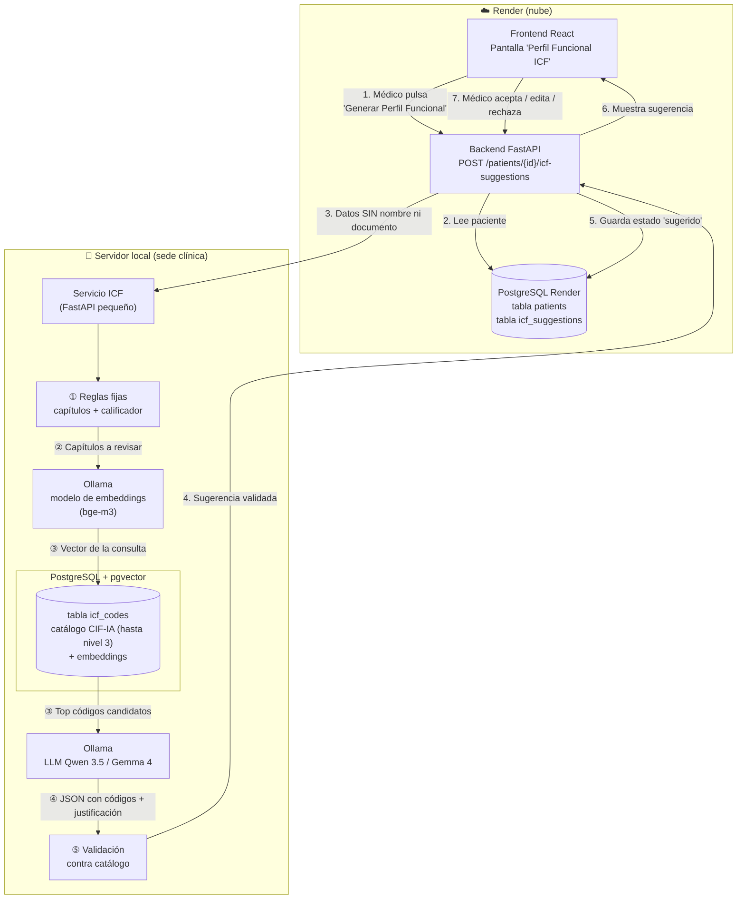
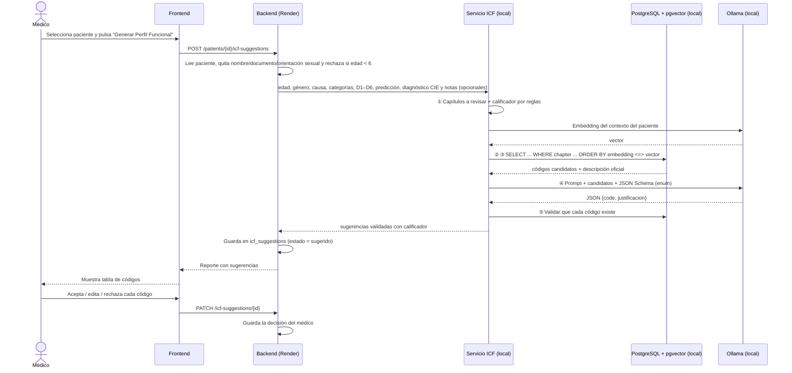
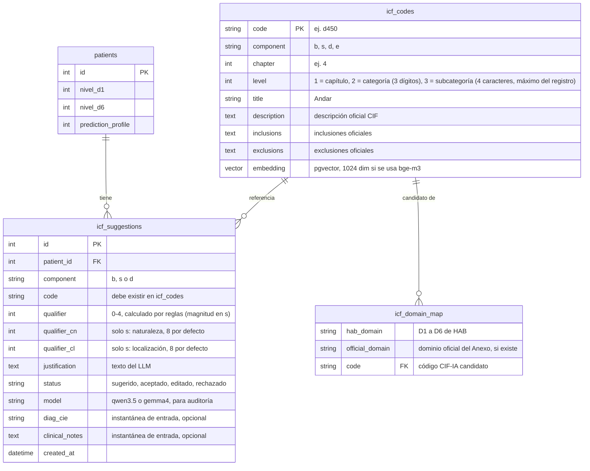

# Cómo funciona la sugerencia de códigos CIF/ICF con RAG en PostgreSQL

**Proyecto:** Health Access Bridge · **Momento 3 · HU-07**
**Objetivo:** que un LLM pequeño (Qwen 3.5 / Gemma 4, ~3B parámetros) sugiera códigos CIF/ICF a partir de los datos del paciente, **sin entrenarlo**, usando solo el estándar CIF como fuente de conocimiento. El médico acepta o edita la sugerencia.
**Marco normativo:** Anexo Técnico de la **Resolución 1239 del 21 de julio de 2022** (procedimiento de certificación de discapacidad y Registro de Localización y Caracterización de Personas con Discapacidad, RLCPD), de aplicación para toda la población con discapacidad de Colombia, que usa la **CIF-IA** (versión infancia y adolescencia, OMS 2011). El perfil de funcionamiento oficial tiene **3 códigos por componente** (funciones b, estructuras s, actividades y participación d), cada uno con calificador. HAB genera un **borrador de apoyo**: el certificado lo emite el equipo multidisciplinario en el aplicativo RLCPD.

---

## 1. La idea en una frase

> **RAG = examen a libro abierto.** No le enseñamos la CIF al modelo (eso sería entrenarlo). En cada consulta **buscamos en PostgreSQL las páginas del "libro" CIF que aplican a ese paciente** y se las damos al modelo junto con la pregunta. El modelo solo elige entre esas opciones y explica por qué.

| Enfoque | Qué requiere | ¿Aplica aquí? |
|---|---|---|
| **Fine-tuning** (entrenar) | Miles de casos etiquetados por médicos + GPU para entrenar | ❌ No hay datos etiquetados |
| **Solo prompt** (preguntarle al modelo "¿qué código CIF es?") | Nada | ❌ Un modelo de 3B **inventa códigos** |
| **RAG** (buscar + dar contexto + restringir la respuesta) | El catálogo CIF cargado en PostgreSQL | ✅ **Enfoque elegido** |

RAG significa *Retrieval-Augmented Generation*: generación de texto aumentada con información recuperada de una base de datos.

---

## 2. Diagrama general



**Qué se queda en cada lugar:**

- **Render (nube):** los pacientes y lo que el médico decide sobre cada sugerencia. Todo esto ya existe hoy, salvo la tabla `icf_suggestions`.
- **Servidor local:** el catálogo CIF (que es información pública), Ollama con los modelos y el servicio que arma la consulta.
- **Hacia el servidor local nunca viaja** el nombre ni el documento del paciente. Solo viajan edad, género, causa, categorías, niveles D1–D6, la predicción de barreras y, si el médico los escribe, el diagnóstico CIE y las notas clínicas. **No se envía la orientación sexual** (no aporta a la codificación). Como las notas son texto libre, la pantalla advierte no incluir datos identificables.

---

## 3. Paso a paso con un paciente real (María Fernanda López)

Datos de entrada, los mismos del mockup:

| Campo | Valor |
|---|---|
| Edad / Género | 35 / Femenino |
| Causa | Enfermedad congénita |
| Cat. física / psicosocial | Severa / Moderada |
| D1 Aprendizaje | 70 |
| D2 Tareas generales | 65 |
| D3 Comunicación | 75 |
| D4 Movilidad | 60 |
| D5 Autocuidado | 55 |
| D6 Vida doméstica | 80 |
| Predicción de barreras | Perfil 2 (barreras altas) |
| Diagnóstico CIE (opcional) | lo escribe el médico en la pantalla; en este ejemplo, vacío |
| Notas clínicas (opcional) | lo escribe el médico en la pantalla; en este ejemplo, vacío |

> Sin diagnóstico ni notas el modelo solo cuenta con la causa y las categorías, así que las sugerencias de funciones (b) y estructuras (s) serán genéricas. El Anexo identifica b y s a partir de la historia clínica (diagnóstico CIE, soportes y causa), por eso la pantalla ofrece estos dos campos.

### ① Reglas fijas (sin LLM)

Los niveles D1–D6 de HAB **corresponden a los capítulos 1 a 6 de "Actividades y Participación" de la CIF** (Aprendizaje, Tareas generales, Comunicación, Movilidad, Autocuidado, Vida doméstica). **No son los 6 dominios oficiales del Anexo** (Cognición, Movilidad, Cuidado personal, Relaciones, Actividades cotidianas, Participación). Se mantienen los niveles de HAB (los usan el modelo predictivo, el formulario y los datos) con un **mapeo explícito**. Dos cosas se resuelven con código normal, sin LLM:

**a) Qué capítulos revisar:** los que tengan nivel ≥ 5 (es decir, con algún problema).

| Nivel HAB | Capítulo CIF-IA | Dominio oficial del Anexo (referencia) |
|---|---|---|
| D1 | d1 — Aprendizaje y aplicación del conocimiento | D1 Cognición |
| D2 | d2 — Tareas y demandas generales | Sin equivalente directo |
| D3 | d3 — Comunicación | Parcial: d310 y d350 están en Cognición |
| D4 | d4 — Movilidad | D2 Movilidad |
| D5 | d5 — Autocuidado | D3 Cuidado personal |
| D6 | d6 — Vida doméstica | D5 Actividades cotidianas (d640, tareas domésticas) |

Los dominios oficiales **Relaciones** (d7) y **Participación** (d9) no tienen equivalente en HAB. Por eso el reporte rotula los niveles como "niveles internos de HAB" y **no** como el "nivel de dificultad en el desempeño" oficial (que el Anexo calcula con fórmulas propias y aclara que no es un porcentaje de discapacidad).

**b) El calificador (gravedad 0–4):** la escala genérica de la CIF (Tabla 2 del Anexo) define rangos en porcentaje, que se aplican a la escala 0–100 de HAB:

| Nivel HAB (0–100) | Calificador CIF | Significado |
|---|---|---|
| 0 – 4 | `.0` | No hay problema |
| 5 – 24 | `.1` | Problema ligero |
| 25 – 49 | `.2` | Problema moderado |
| 50 – 95 | `.3` | Problema grave |
| 96 – 100 | `.4` | Problema completo |

En María todos sus niveles están entre 50 y 95, así que **todos sus capítulos llevan calificador `.3` (grave)**. Esto lo calcula el código y **el LLM no lo decide**, para que no pueda equivocarse en la gravedad.

> ⚠️ **Limitación a tener en cuenta:** HAB mide un nivel por **capítulo** (ej. "Movilidad = 60"), pero la CIF codifica por **categoría** (ej. d450 Andar, d440 Uso fino de la mano), y oficialmente el calificador sale de **cada pregunta** del instrumento (0–4), no del porcentaje del dominio. El calificador de cada categoría sugerida se toma del nivel de su capítulo. Es una aproximación, queda marcada como **sugerida** y **el médico puede editarla**. En funciones (b) y estructuras (s) solo cuentan calificadores desde 1.

**c) Pacientes menores de 6 años:** el Anexo no calcula niveles por dominio para 0–5 años (usa una lista de chequeo sin puntajes). Si la edad es menor de 6, el sistema avisa y no genera la sugerencia basada en D1–D6.

### ② y ③ Búsqueda en PostgreSQL (la "R" de RAG)

Para cada capítulo relevante, el servicio busca en la tabla `icf_codes` las categorías que más se parecen al caso del paciente. La búsqueda es híbrida:

1. **Pre-filtro por reglas con el Anexo:** las tablas 7–9 y 11 del Anexo ligan cada dominio con códigos CIF-IA concretos (ej. Movilidad: `d4154`, `d4104`, `d4600`, `d4602`, `d4501`; Cognición: `b1400`, `d161`, `b144`, `d175`, `d155`, `d310`, `d350`). Esos códigos se transcriben a una tabla de candidatos (`icf_domain_map`) y entran primero a la lista. El PDF escaneado se lee mal en varios códigos, por lo que se transcriben revisando el original.
2. **Filtro exacto en SQL:** categorías del capítulo (ej. d4) de segundo y tercer nivel (de 3 y 4 caracteres, como `d450` o `b2100`; el registro oficial admite hasta el tercer nivel).
3. **Orden por similitud semántica con pgvector:** se construye un texto con el contexto del paciente (*"enfermedad congénita, compromiso físico severo, movilidad"*), se convierte en vector con el modelo de embeddings y se ordena el catálogo por cercanía a ese vector.

```sql
SELECT code, title, description
FROM icf_codes
WHERE component = 'd'
  AND chapter = 4
  AND level IN (2, 3)
ORDER BY embedding <=> :query_embedding   -- <=> = distancia coseno (pgvector)
LIMIT 12;
```

Resultado de ejemplo para D4: `d410 Cambiar las posturas corporales básicas`, `d415 Mantener la posición del cuerpo`, `d440 Uso fino de la mano`, `d450 Andar`, `d455 Desplazarse por el entorno`, `d465 Desplazarse utilizando algún tipo de equipamiento`…

Lo mismo se hace con **funciones corporales (b)** y **estructuras corporales (s)**, usando la categoría física y psicosocial, la causa y, si existen, el diagnóstico CIE y las notas. Por ejemplo, `b710 Movilidad de las articulaciones`, `b730 Fuerza muscular`, `b280 Sensación de dolor`, `s750 Estructura de la extremidad inferior`.

> Con un catálogo de ~1.500 categorías y solo 6 capítulos, este filtro reduce las opciones a **30–60 candidatos**. Esa cantidad cabe cómodamente en el contexto de un modelo de 3B.

### ④ El LLM elige y justifica (la "G" de RAG)

El prompt le entrega al modelo:
- los datos del paciente (sin nombre ni documento) y, si el médico los escribió, el diagnóstico CIE y las notas clínicas;
- la lista de candidatos con su **título y descripción oficial**;
- la instrucción: *"Elige solo de esta lista, como máximo 3 categorías por componente (funciones, estructuras, actividades y participación), ordenadas por relevancia, y justifica cada una en una frase"*.

Para que el modelo **no pueda inventar**, se usa la **salida estructurada** de Ollama (`format` = JSON Schema). Los códigos candidatos van como `enum`, y cualquier otro valor queda fuera del formato permitido:

```json
{
  "type": "object",
  "properties": {
    "funciones": {
      "type": "array",
      "maxItems": 3,
      "items": {
        "type": "object",
        "properties": {
          "code":          { "type": "string", "enum": ["b710", "b730", "b280"] },
          "justificacion": { "type": "string" }
        },
        "required": ["code", "justificacion"]
      }
    },
    "estructuras": {
      "type": "array",
      "maxItems": 3,
      "items": {
        "type": "object",
        "properties": {
          "code":          { "type": "string", "enum": ["s730", "s750"] },
          "justificacion": { "type": "string" }
        },
        "required": ["code", "justificacion"]
      }
    },
    "actividades": {
      "type": "array",
      "maxItems": 3,
      "items": {
        "type": "object",
        "properties": {
          "code":          { "type": "string", "enum": ["d410", "d415", "d440", "d450", "d455", "d465"] },
          "justificacion": { "type": "string" }
        },
        "required": ["code", "justificacion"]
      }
    }
  },
  "required": ["funciones", "estructuras", "actividades"]
}
```

La llamada se hace con `temperature: 0`, para que la misma entrada dé siempre la misma salida.

### ⑤ Validación antes de devolver

El servicio revisa la respuesta del LLM:
- ¿el JSON es válido?
- ¿cada código existe en `icf_codes`?
- se le pega el calificador calculado en el paso ① → `d450.3`;
- en estructuras (s) el calificador son tres dígitos (magnitud, naturaleza del cambio, localización): la magnitud sale de las reglas y naturaleza y localización quedan en **8 (no especificada)**, p. ej. `s750.388`, para que el médico los edite;
- se descarta cualquier componente con más de 3 códigos (queda el de mayor relevancia).
- se completa el título oficial desde el catálogo. **El título lo pone la base de datos, no el LLM.**

> 💡 **Por qué importa:** en el mockup actual aparece "d450 — Sensación de dolor". Pero **d450 es "Andar"**; "Sensación de dolor" es **b280**. Es justo el tipo de error que comete un LLM sin RAG. Con este diseño es imposible, porque el título siempre sale del catálogo oficial.

### Resultado que ve el médico

| Componente | Código | Título (del catálogo) | Calificador | Justificación (del LLM) | Acción |
|---|---|---|---|---|---|
| Actividades (d) | d450.3 | Andar | Grave | Compromiso físico severo por enfermedad congénita con D4 = 60 | ✅ Aceptar / ✏️ Editar / ❌ Rechazar |
| Funciones (b) | b730.3 | Fuerza muscular | Grave | … | … |
| Estructuras (s) | s750.388 | Estructura de la extremidad inferior | Magnitud 3; naturaleza y localización sin especificar | … | … |
| … | … | … | … | … | … |

Máximo 3 filas por componente. El reporte indica que es un **borrador de apoyo** (no sustituye el certificado del RLCPD) y cita la Resolución 1239 del 21 de julio de 2022.

---

## 4. Secuencia completa



---

## 5. Tablas en PostgreSQL



- **`icf_codes`** se carga **una sola vez** con un script. El script lee el catálogo CIF-IA en español, calcula el embedding de `title + description` de cada categoría con Ollama y lo guarda en la columna `embedding`.
- **`icf_suggestions`** guarda lo que sugirió el modelo y lo que decidió el médico. Así hay trazabilidad clínica: se sabe qué sugirió la máquina y qué aprobó el profesional.
- **`icf_domain_map`** guarda el mapeo explícito de los niveles de HAB con los capítulos CIF-IA y los códigos candidatos transcritos del Anexo.
- El diagnóstico CIE y las notas **no son columnas de `patients`**: se guardan como instantánea de entrada en `icf_suggestions`. El proyecto no tiene migraciones y `build.sh` solo revisa un conjunto fijo de columnas, así que las columnas nuevas de `patients` no se crearían en bases existentes.

---

## 6. Cómo "aprende" el sistema sin entrenarlo

Cada vez que un médico **acepta** o **edita** una sugerencia, ese caso queda guardado en `icf_suggestions`. Más adelante (en una tarea posterior, no en la primera):

1. Al generar una sugerencia nueva, se buscan los **2–3 casos aceptados más parecidos** (por niveles D1–D6 y causa).
2. Se agregan al prompt como **ejemplos resueltos** (*few-shot*): *"Para un paciente así, el médico aprobó estos códigos"*.

El modelo sigue siendo el mismo y nunca se reentrena, pero las sugerencias mejoran porque el "libro abierto" ahora incluye casos validados por médicos.

---

## 7. Por qué este diseño funciona con modelos pequeños (3B)

| Riesgo de un modelo pequeño | Cómo se controla |
|---|---|
| Inventa códigos que no existen | `enum` en el JSON Schema + validación contra `icf_codes` |
| Pone el título equivocado a un código | El título sale de la base de datos, nunca del LLM |
| Se equivoca en la gravedad | El calificador se calcula por reglas, no lo decide el LLM |
| No le cabe toda la CIF en el contexto | Solo recibe 30–60 candidatos filtrados |
| Da respuestas distintas cada vez | `temperature: 0` |
| Responde en texto libre difícil de procesar | Salida estructurada en JSON (`format` de Ollama) |
| Poca información clínica para funciones y estructuras | Campos opcionales de diagnóstico CIE y notas; sin ellos, las sugerencias de b y s son genéricas y así se indica |
| Error clínico | **El médico siempre valida**: el sistema sugiere, no decide |

---

## 8. Relación con el backlog (HU-07)

Revisión de [`BACKLOG.md`](../../BACKLOG.md), sección *Momento 3*:

- **DEUDA-01** (Sprint 8) ya está ✅ cerrada, así que **la primera tarea abierta del Momento 3 es HU-07** (25 pts tras la reestimación del 05-oct-2026; eran 21).
- La **primera tarea listada en HU-07** es: *"Aprovisionar y configurar el servidor físico (hardware, SO, dependencias, runtime de inferencia)"*.
- Ya está decidido (23-sep-2026) usar **Ollama sobre un servidor propio, con un modelo open-weight gratuito**.

**Ajustes aplicados al backlog (05-oct-2026):**

1. Se eligió **RAG** (sin fine-tuning), porque no hay datos etiquetados para entrenar.
2. Se agregó la pantalla "Perfil Funcional ICF" con el flujo de **aceptar/editar/rechazar** del médico.
3. **Privacidad:** los datos identificables no salen de Render; al servidor local solo viajan datos sin nombre, documento ni orientación sexual. La conexión es por **túnel autenticado** (Cloudflare Tunnel o Tailscale).
4. HU-07 se dividió en sub-historias 07a–07e.
5. **Ajustes por el Anexo Técnico de la Resolución 1239 del 21 de julio de 2022:** catálogo **CIF-IA** hasta el tercer nivel; salida de **3 códigos por componente (b, s, d)**; **estructuras (s)** con magnitud y naturaleza/localización en 8 por defecto; mapeo explícito de los niveles de HAB (se mantienen) con los dominios oficiales; **diagnóstico CIE y notas opcionales**; lista oficial de causa de deficiencia; aviso para menores de 6 años; y leyenda de borrador de apoyo.

**Limitación conocida:** HAB captura 2 de las 7 categorías de discapacidad del Anexo (física y psicosocial), así que la sugerencia cubrirá mejor lo físico y lo psicosocial que lo visual, auditivo o intelectual.

---

## 9. Glosario rápido

| Término | Qué es |
|---|---|
| **CIF / ICF** | Clasificación Internacional del Funcionamiento, de la Discapacidad y de la Salud (OMS). En Colombia se usa en el procedimiento de certificación de discapacidad (Resolución 1239 del 21 de julio de 2022, aplicable a toda la población con discapacidad de Colombia). |
| **CIF-IA** | Versión de la CIF para la infancia y la adolescencia (OMS, 2011); es la referencia que exige el Anexo. |
| **RLCPD** | Registro de Localización y Caracterización de Personas con Discapacidad; el certificado oficial se genera ahí, no en HAB. |
| **Perfil de funcionamiento** | Parte del certificado: 3 códigos CIF-IA por componente (funciones, estructuras, actividades y participación), cada uno con calificador. |
| **Componente** | `b` = funciones corporales, `s` = estructuras corporales, `d` = actividades y participación, `e` = factores ambientales. |
| **Categoría** | Código específico, ej. `d450` (Andar). |
| **Calificador** | Número después del punto que indica la gravedad: `d450.3` = problema grave para andar. |
| **RAG** | Buscar información relevante en una base de datos y dársela al LLM junto con la pregunta. |
| **Embedding** | Representación numérica (vector) del significado de un texto. Permite buscar "por parecido" y no solo por palabras exactas. |
| **pgvector** | Extensión de PostgreSQL que guarda embeddings y busca por similitud (`<=>`). |
| **Ollama** | Programa que ejecuta LLMs localmente en el servidor, sin internet. |
| **Salida estructurada** | Obligar al LLM a responder en un JSON con un formato fijo. |
